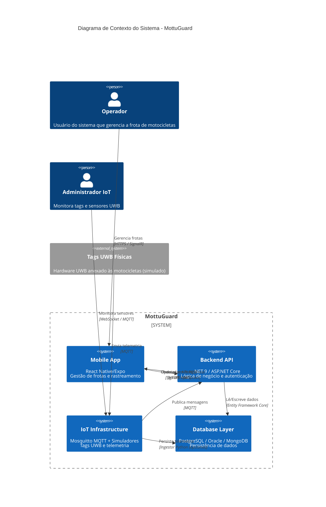
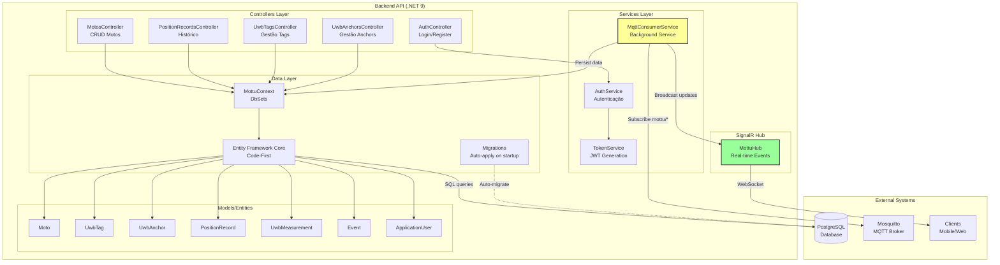
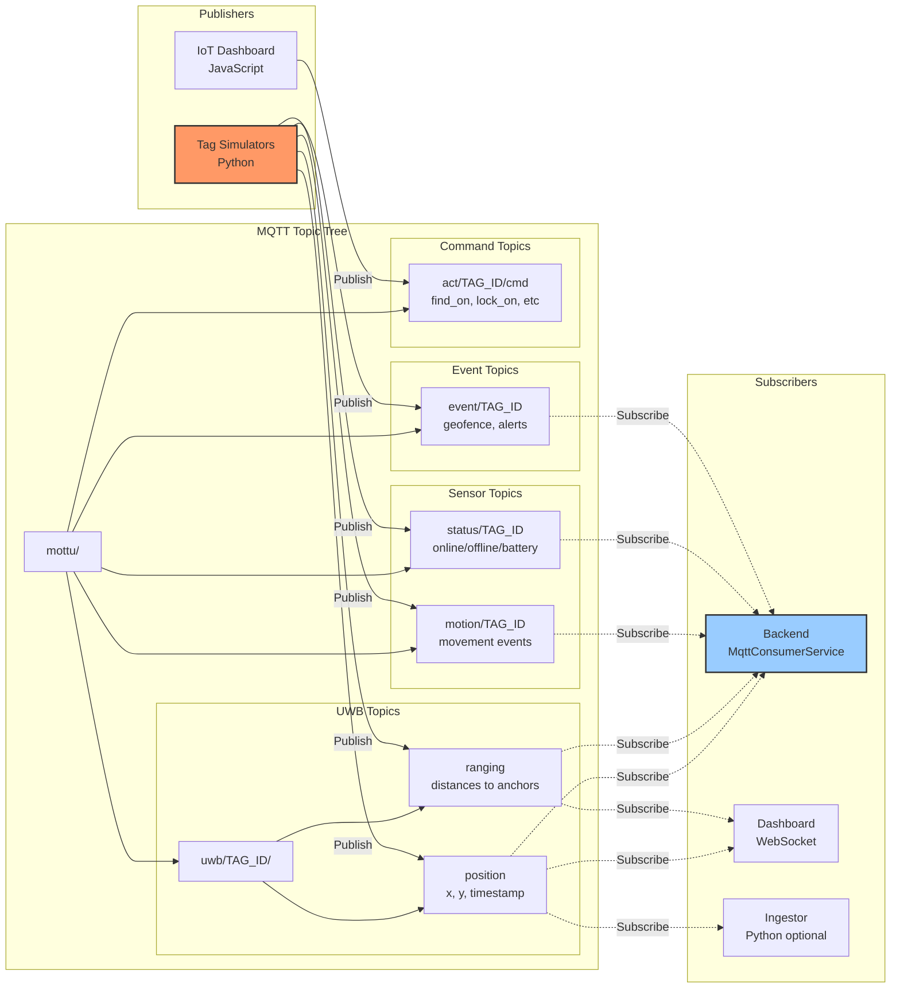
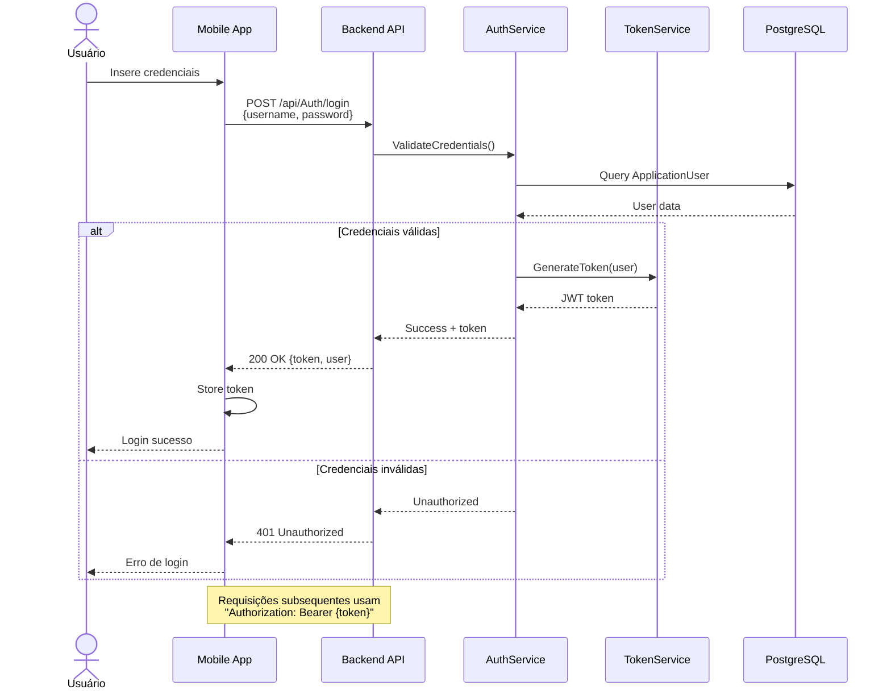
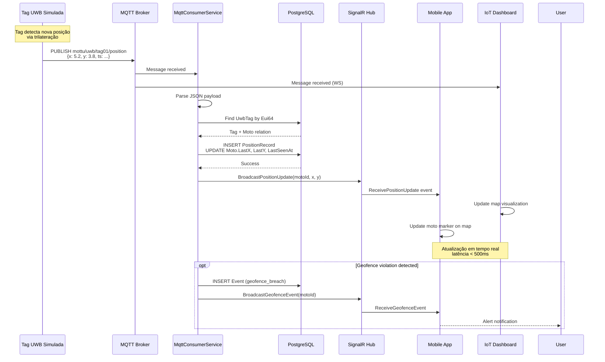
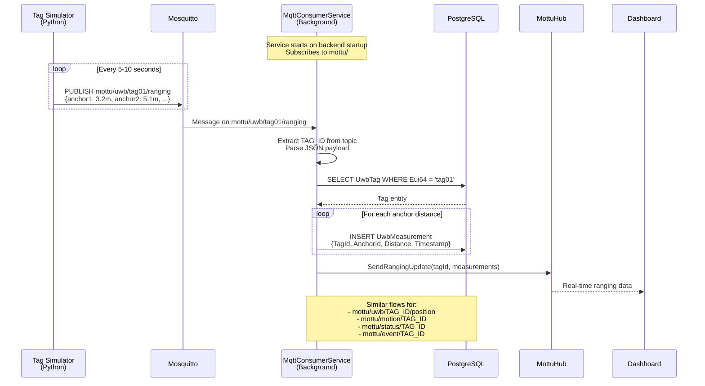
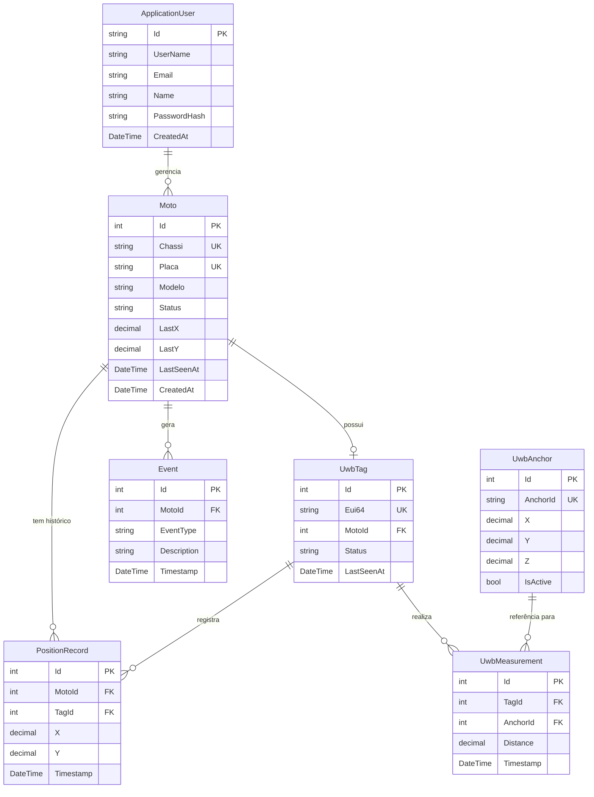

# MottuGuard

Sistema de gestão de frotas de motocicletas com rastreamento indoor utilizando tecnologia UWB (Ultra Wideband) e BLE (Bluetooth Low Energy).

## Visão Geral

**MottuGuard** é uma solução completa para monitoramento e gestão de frotas de motocicletas em tempo real, combinando rastreamento de localização indoor de alta precisão com uma plataforma de gestão robusta. O sistema permite acompanhar a localização das motocicletas, receber alertas de eventos (movimento, geofencing, offline) e gerenciar o status da frota através de aplicativo mobile e APIs.

### Principais Funcionalidades

- Rastreamento em tempo real de motocicletas via tecnologia UWB
- Gestão de status da frota (Disponível, Reservada, Em Manutenção, Bloqueada, Perdida)
- Notificações em tempo real via SignalR
- Alertas de geofencing e detecção de movimento
- Histórico de posições e eventos
- API REST completa para integração
- Aplicativo mobile para gestão da frota
- Dashboard web para monitoramento IoT

### Equipe

- **Gabriel Augusto Fernandes** - RM99711
- **Jaqueline Martins dos Santos** - RM551744
- **Matheus Oliveira da Silva** - RM99792
- **Gilberto Ramos da Silva Neto** - RM551413

### Links

- [Vídeo Demonstração](https://www.youtube.com/watch?v=dQw4w9WgXcQ)
- [Protótipo Figma](https://www.figma.com/design/example)

---

## Arquitetura do Sistema

O MottuGuard é composto por **quatro componentes principais** que trabalham de forma integrada:

1. **Backend** - API ASP.NET Core com PostgreSQL, responsável pela lógica de negócio, autenticação e persistência
2. **Mobile** - Aplicativo React Native (Expo) para gestão da frota por operadores
3. **IoT** - Infraestrutura de simulação MQTT com broker Mosquitto, simuladores de tags UWB e dashboard web
4. **Database** - Suporte multi-database (PostgreSQL principal, Oracle SQL legacy, MongoDB alternativo)

### Diagrama C4 - Contexto do Sistema



---

## Arquitetura de Componentes

### Backend - Estrutura Interna



### Tópicos MQTT - Estrutura de Mensagens



---

## Fluxos de Dados

### Fluxo de Autenticação



### Fluxo de Rastreamento em Tempo Real



### Fluxo de Processamento MQTT



---

## Modelo de Domínio

### Diagrama de Entidade-Relacionamento



### Principais Entidades

- **Moto**: Representa uma motocicleta da frota
  - Status: `Disponivel`, `Reservada`, `EmManutencao`, `Bloqueada`, `Perdida`
  - Armazena última posição conhecida (LastX, LastY, LastSeenAt)

- **UwbTag**: Tag UWB física anexada à motocicleta
  - Identificada por Eui64 (ex: "tag01", "tag02")
  - Relacionada 1:1 com Moto

- **UwbAnchor**: Pontos de referência fixos para trilateração
  - Posição conhecida (X, Y, Z)
  - Seedados no startup (4 anchors por padrão)

- **UwbMeasurement**: Medições de distância brutas
  - Distância da Tag até cada Anchor
  - Base para cálculo de posição

- **PositionRecord**: Histórico de posições calculadas
  - Trail de movimento ao longo do tempo
  - Gerado a partir de trilateração ou diretamente de topic MQTT

- **Event**: Eventos de alto nível
  - Tipos: `offline`, `geofence_breach`, `motion_detected`, `low_battery`

---

## Stack Tecnológico

### Backend
- **.NET 9** - Framework principal
- **ASP.NET Core** - Web API com Controllers
- **PostgreSQL** - Banco de dados principal
- **Entity Framework Core** - ORM com Code-First migrations
- **ASP.NET Core Identity** - Gerenciamento de usuários
- **JWT (JSON Web Tokens)** - Autenticação stateless
- **SignalR** - Comunicação real-time bidirecional
- **MQTTnet** - Cliente MQTT para subscrição de telemetria
- **Swagger/OpenAPI** - Documentação interativa da API
- **Docker** - Containerização

### Mobile
- **React Native** - Framework mobile cross-platform
- **Expo** - Toolchain e SDK
- **TypeScript** - Tipagem estática
- **React Navigation** - Navegação entre telas
- **React Native Paper** - Biblioteca de componentes UI
- **Axios** - Cliente HTTP

### IoT
- **Mosquitto** - MQTT Broker (TCP + WebSockets)
- **Python 3** - Simuladores de tags UWB
- **Paho MQTT** - Biblioteca Python MQTT
- **HTML/JavaScript** - Dashboard web de monitoramento
- **PostgreSQL** (opcional) - Persistência via Ingestor

### Database
- **PostgreSQL** - Banco principal (Backend + IoT)
- **Oracle SQL** - Schema legacy com packages PL/SQL
- **MongoDB** - Schema alternativo NoSQL

### Infraestrutura
- **Docker & Docker Compose** - Desenvolvimento local
- **Azure Container Registry (ACR)** - Registry de imagens
- **Azure Container Instances (ACI)** - Deploy em produção

---

## Início Rápido

### Pré-requisitos

- **Para Backend:**
  - .NET 9 SDK
  - Docker e Docker Compose
  - PostgreSQL (ou via Docker)

- **Para Mobile:**
  - Node.js 18+
  - npm ou yarn
  - Expo CLI
  - Expo Go app (iOS/Android) ou emulador

- **Para IoT:**
  - Docker e Docker Compose
  - Python 3.9+ (para simuladores)

### Setup Rápido - Ambiente Completo

#### 1. Backend API + PostgreSQL

```bash
cd backend
docker compose up -d

# Verificar logs
docker logs -f backend-challenge-mottu

# API disponível em: http://localhost:8080
# Swagger UI: http://localhost:8080/swagger
```

#### 2. Mobile App

```bash
cd mobile
npm install
npm start

# Escanear QR code com Expo Go ou:
npm run android  # Android
npm run ios      # iOS (apenas macOS)
```

**Configuração:** Edite `mobile/src/config/env.ts` com a URL do backend.

#### 3. IoT Infrastructure

```bash
cd iot
docker compose up -d

# Iniciar simuladores de tags
cd simulators
py -m pip install -r requirements.txt
py tag_sim.py tag01  # Terminal 1
py tag_sim.py tag02  # Terminal 2
py tag_sim.py tag03  # Terminal 3

# Dashboard: http://localhost:8081
# MQTT: localhost:1883 (TCP) | ws://localhost:8080 (WebSocket)
```

### Teste Rápido da API

```bash
# Registrar usuário
curl -X POST http://localhost:8080/api/Auth/register \
  -H "Content-Type: application/json" \
  -d '{"username":"admin","email":"admin@test.com","name":"Admin","password":"Admin!234"}'

# Login (obter token JWT)
curl -X POST http://localhost:8080/api/Auth/login \
  -H "Content-Type: application/json" \
  -d '{"username":"admin","password":"Admin!234"}'

# Listar motos (usando token)
curl http://localhost:8080/api/Motos \
  -H "Authorization: Bearer {SEU_TOKEN_AQUI}"
```

### Variáveis de Ambiente

**Backend** (`appsettings.json` ou variáveis de ambiente):

```bash
ConnectionStrings__DefaultConnection="Host=localhost;Database=mottu;Username=postgres;Password=postgres"
Jwt__Key="<base64-encoded-key-min-32-chars>"
Jwt__Issuer="MottuGuard"
Jwt__Audience="MottuGuardClients"
Mqtt__Host="localhost"
Mqtt__Port="1883"
```

**Mobile** (`src/config/env.ts`):

```typescript
export const API_URL = 'http://192.168.1.100:8080'; // IP da máquina host
```

**IoT Ingestor** (opcional):

```bash
PG_DSN='dbname=mottu user=postgres password=postgres host=localhost port=5432'
```

---

## Documentação dos Componentes

Cada componente possui documentação detalhada em seu respectivo diretório:

- **[Backend](./backend/README.md)** - API .NET, migrations, controllers, services
- **[Mobile](./mobile/README.md)** - App React Native, estrutura de telas e services
- **[IoT](./iot/README.md)** - Simuladores, dashboard, broker MQTT
- **[Database](./database/README_MONGODB.md)** - Schemas Oracle e MongoDB

---

## Deploy

### Desenvolvimento Local (Docker Compose)

Cada componente possui um `docker-compose.yml` para desenvolvimento local:

```bash
# Backend + PostgreSQL
cd backend && docker compose up -d

# IoT (Mosquitto + Dashboard + PostgreSQL)
cd iot && docker compose up -d
```

### Produção (Azure)

O backend possui scripts para deploy em Azure Container Instances:

```bash
cd backend

# Build e push para Azure Container Registry
./build.sh

# Deploy no Azure (ACI)
./deploy.sh
```

**Recursos criados:**
- Azure Container Registry (ACR)
- Azure Container Instances (ACI) para PostgreSQL
- Azure Container Instances (ACI) para API

---

## API Reference

### Principais Endpoints

**Autenticação:**
- `POST /api/Auth/register` - Registrar novo usuário
- `POST /api/Auth/login` - Login (retorna JWT token)
- `GET /api/Auth/profile` - Perfil do usuário autenticado

**Motocicletas:**
- `GET /api/Motos` - Listar todas as motos
- `GET /api/Motos/{id}` - Detalhes de uma moto
- `POST /api/Motos` - Cadastrar nova moto
- `PUT /api/Motos/{id}` - Atualizar moto
- `DELETE /api/Motos/{id}` - Remover moto
- `GET /api/Motos/{id}/position-history` - Histórico de posições

**Tags UWB:**
- `GET /api/UwbTags` - Listar tags
- `GET /api/UwbTags/{id}` - Detalhes de uma tag
- `POST /api/UwbTags` - Cadastrar tag
- `PUT /api/UwbTags/{id}/assign` - Associar tag a moto

**Posições:**
- `GET /api/PositionRecords` - Histórico de posições
- `GET /api/PositionRecords/moto/{motoId}` - Posições de uma moto específica

**SignalR Hub** (`/mottuHub`):
- `ReceivePositionUpdate` - Atualização de posição em tempo real
- `ReceiveRangingUpdate` - Medições de distância
- `ReceiveGeofenceEvent` - Alertas de geofencing
- `ReceiveMotionEvent` - Eventos de movimento
- `ReceiveStatusUpdate` - Status das tags

**Documentação Completa:** Acesse `/swagger` quando executar o backend em modo Development.

---

## Contribuindo

Este é um projeto acadêmico desenvolvido para a disciplina de **Engenharia de Software** da FIAP.

### Workflow de Desenvolvimento

1. Clone o repositório
2. Crie uma branch para sua feature: `git checkout -b feature/nova-funcionalidade`
3. Faça commit das alterações: `git commit -m 'Add nova funcionalidade'`
4. Push para a branch: `git push origin feature/nova-funcionalidade`
5. Abra um Pull Request

---

## Licença

Este projeto é parte de um trabalho acadêmico e está disponível para fins educacionais.

**Curso:** Análise e Desenvolvimento de Sistemas - FIAP
**Disciplina:** Engenharia de Software
**Ano:** 2024/2025

---

